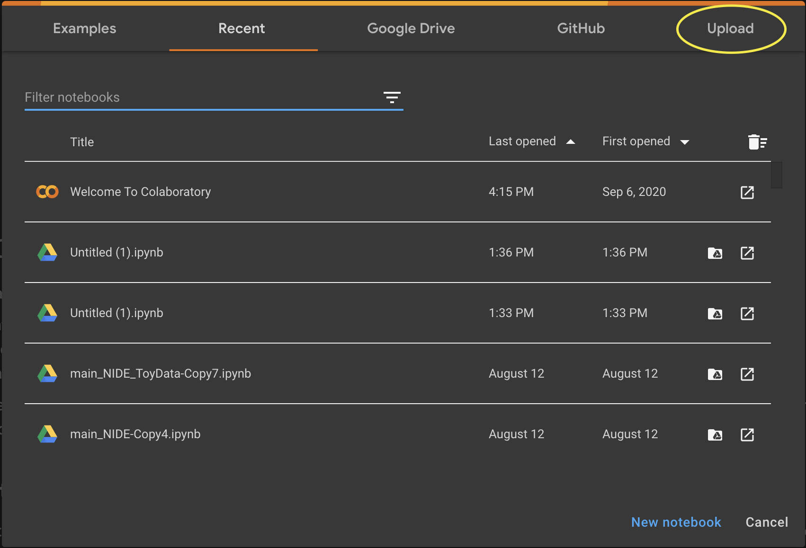
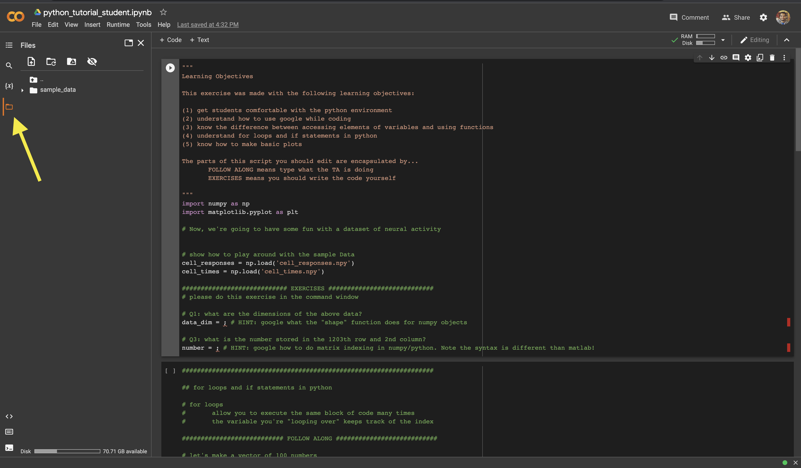

# INP Bootcamp - Python Intro

## Things you need to do to get started:

- Create an account in github: [link](https://github.com/join) 
- Install github (please follow the instructions for your OS): [link](https://github.com/git-guides/install-git)
- Create a personal token [here](https://docs.github.com/en/github/authenticating-to-github/keeping-your-account-and-data-secure/creating-a-personal-access-token) 

### Clone this repository

| Command | Description |
| ------- | ----------- |
| `git init` | Initialize a local Git repository |
| `git clone https://github.com/ahof1704/INP_bootcamp_Python_Intro.git` | Create a local copy of a remote repository |

### Using Google Colab 
The Google Colaboratory (“Colab”) is a notebook (like a Jupyter Notebook) where you can run Python code in your Google Drive. This will allow us to avoid spending time to setup Python on your computers :) 

1. To upload the files to Colab, use this [link](https://colab.research.google.com/). Click on "Upload" and select the jupyter notebook `python_tutorial_student.ipynb` cloned from the GitHub repository .

2. Click on the 'Files' shortcut and upload the remaining files to be used.

*!!!!!!!IMPORTANT!!!!!!!* 

Colab is a temporary virtual machine and your files will be deleted by the end of the session. So remember to download your jupyter notebook by the end of your session. An alternative to this temporary virtual disk would be to upload your files to your Google Drive or create a branch of the GitHub repo and work there (ask the TA's if you would like more details on how to do that).

